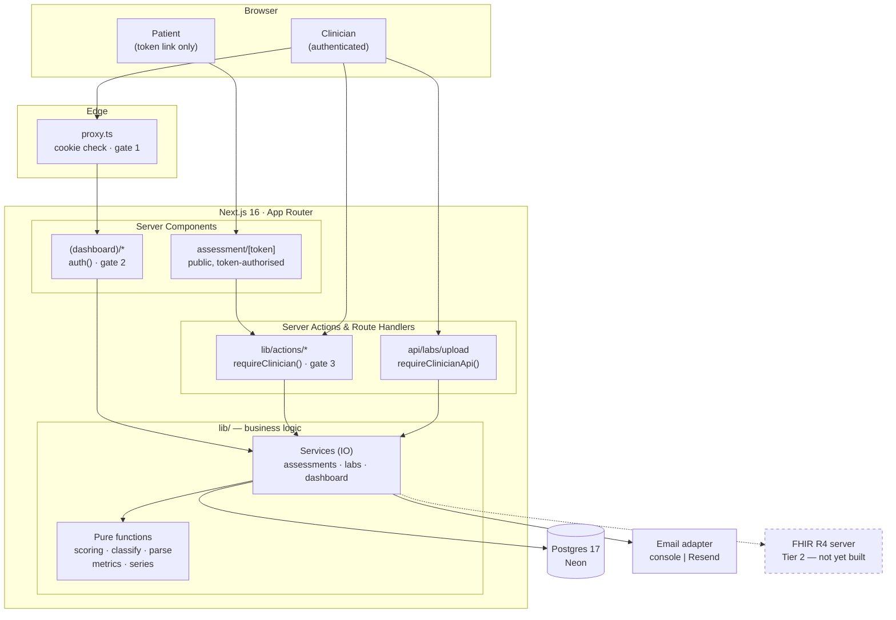
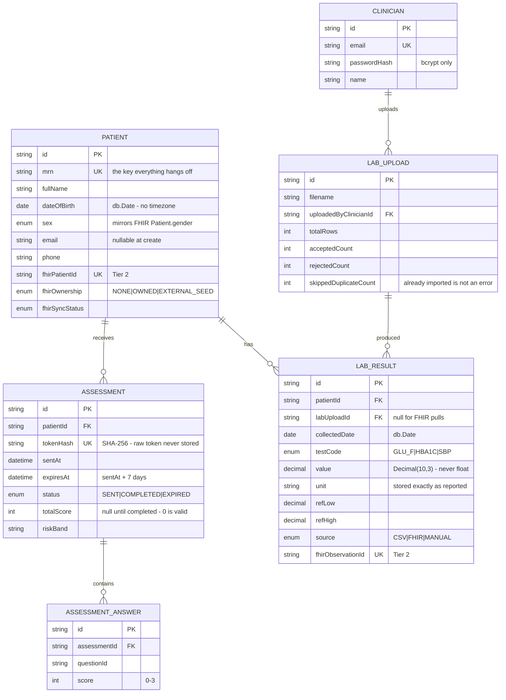
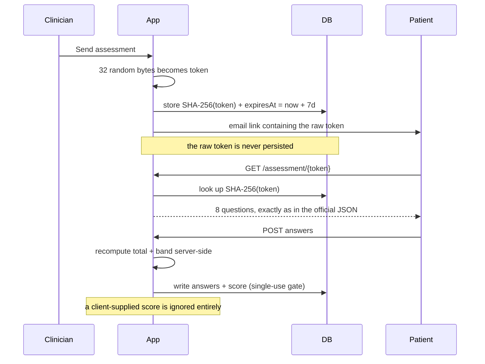

# PulseTrack

Remote patient monitoring for a diabetes clinic — a clinician logs in, manages a
patient register, emails patients a tokenized DSMA-8 questionnaire link, imports
lab results from messy CSV files, and reads the results as per-patient trends and
clinic-wide figures.

Built as a timed engineering challenge for **Capadev**.

> **Status:** Tier 1 (core platform) is complete. Tier 2 (FHIR integration) is
> scaffolded in the data model but not yet implemented — see
> [What is and isn't built](#what-is-and-isnt-built).

---

## Contents

- [Quick start](#quick-start) — running locally in under 10 minutes
- [Architecture](#architecture)
- [Data model (ERD)](#data-model-erd)
- [How the three core flows work](#how-the-three-core-flows-work)
- [Security](#security)
- [Testing](#testing)
- [Decisions and tradeoffs](#decisions-and-tradeoffs)
- [What is and isn't built](#what-is-and-isnt-built)

---

## Quick start

**Prerequisites:** Node.js 20+, and a Postgres database. The instructions below
use [Neon](https://neon.tech)'s free tier, which needs no credit card and is what
this project was developed against.

### 1. Install

```bash
git clone https://github.com/JoeYoussef44/PulseTrack.git
cd PulseTrack
npm install
```

`npm install` runs `prisma generate` automatically via `postinstall`, which
writes the typed client into `lib/generated/prisma`.

### 2. Create a database

Sign up at [neon.tech](https://neon.tech), create a project, and copy **both**
connection strings from the dashboard:

- the **pooled** string (host contains `-pooler`) → `DATABASE_URL`
- the **direct** string → `DIRECT_URL`

Two URLs are needed because serverless functions must go through the connection
pooler, while `prisma migrate` requires a direct session. See
[D-1](#d-1-two-database-urls).

### 3. Configure

```bash
cp .env.example .env
```

Fill in `.env`:

| Variable | Required | What it is |
|---|---|---|
| `DATABASE_URL` | ✅ | Neon **pooled** connection string |
| `DIRECT_URL` | ✅ | Neon **direct** connection string |
| `AUTH_SECRET` | ✅ | 32 random bytes — generate with `npx auth secret` |
| `SEED_CLINICIAN_EMAIL` | ✅ | The login the seed creates, e.g. `clinician@pulsetrack.local` |
| `SEED_CLINICIAN_PASSWORD` | ✅ | That login's password — choose anything |
| `APP_BASE_URL` | ✅ | `http://localhost:3000` locally; the deployed origin in production |
| `EMAIL_PROVIDER` | — | Leave empty to use the console adapter (see below) |
| `EMAIL_API_KEY`, `EMAIL_FROM` | — | Only if `EMAIL_PROVIDER=resend` |
| `FHIR_*` | — | Tier 2 only; unused today |
| `AI_*` | — | Tier 3 only; unused today |

### 4. Migrate and seed

```bash
npm run db:migrate    # creates the schema
npm run db:seed       # idempotent — safe to re-run
```

The seed creates one clinician, three patients (`MRN-1001` Jane Doe,
`MRN-1002` Samir Aoun, `MRN-1003` Rana Bitar), and an assessment history with
real trajectories so the dashboard has something to draw on first run. The three
MRNs are deliberately the ones referenced by the supplied
`lab-results-sample-clean.csv`, so that file imports 10/10 immediately — see
[D-6](#d-6-seeding-the-sample-csvs-mrns).

### 5. Run

```bash
npm run dev
```

Open <http://localhost:3000> and sign in with `SEED_CLINICIAN_EMAIL` /
`SEED_CLINICIAN_PASSWORD`.

### 6. See it working end to end

1. **Patients** → the three seeded patients, with search.
2. Open **Jane Doe** → four trend charts and her assessment history.
3. **Labs → Upload** → *Download template*, then upload
   `.docs/lab-results-sample-clean.csv` from this repo. It reports 10 accepted on
   a clean database, and 10 *already imported* if you upload it twice.
4. On a patient page, **Send assessment** → with no email provider configured the
   invitation is logged to your terminal and the UI shows a copy-able link. Open
   it in a private window to fill in the questionnaire as the patient would.

### Email in development

With `EMAIL_PROVIDER` unset, PulseTrack uses a **console adapter**: the email
body is written to the server log and the clinician is shown the assessment link
directly in the UI. This is deliberate rather than a stub — Resend's free tier
only delivers to the account owner's own address, so a live key would make the
demo *less* reproducible for an evaluator, not more.

---

## Architecture



### Layering rule

**Business logic lives in `lib/`, never in components. Pages fetch and render.**
Anything an evaluator is likely to probe — scoring, CSV validation, risk
classification, pagination, aggregate maths — is a **pure function** with no IO,
which is why the test suite can cover it exhaustively without a database.

```
lib/
├── assessments/  definition (loads the official DSMA-8 JSON) · scoring (pure)
│                 token · service
├── labs/         test-catalog · parse (pure) · classify (pure) · series (pure)
│                 service (IO)
├── dashboard/    metrics (pure) · service (IO)
├── email/        provider abstraction + console/resend adapters
├── validation/   Zod schemas
├── actions/      server actions — every one calls requireClinician()
├── fhir/         pagination helper (Tier 2 groundwork)
└── db.ts         Prisma singleton, server-only
```

### Authorization is three layers deep

Each layer is independently sufficient, because any one of them can be
misconfigured:

| Layer | Where | What it does | Why it isn't enough alone |
|---|---|---|---|
| 1 | `proxy.ts` (edge) | Rejects requests with no session cookie | A wrong `matcher` regex silently opens everything |
| 2 | `auth()` in each page | Server-renders nothing without a session | Doesn't cover POSTs |
| 3 | `requireClinician()` in every mutation | **The actual boundary** | — |

Hidden UI and the edge proxy are conveniences. Layer 3 is what holds when
somebody posts directly to an endpoint.

---

## Data model (ERD)



### The two constraints that carry the brief's guarantees

Both are **database** constraints, not application checks, so they hold under
concurrency rather than merely under well-behaved usage:

```prisma
@@unique([patientId, collectedDate, testCode])   // LabResult
@@unique([assessmentId, questionId])             // AssessmentAnswer
```

The first is the brief's duplicate-lab rule — same patient, same date, same test.
The second is why a double-submitted questionnaire writes eight answers, not
sixteen. Both were verified against the real database with concurrent requests,
not reasoned about.

### Three deliberate column choices

- **`@db.Date`, not `DateTime`,** for `dateOfBirth` and `collectedDate`. A birth
  date has no time zone; storing it as a timestamp produces off-by-one-day
  rendering west of UTC. All date handling goes through `parseIsoDate` /
  `toIsoDate` in `lib/validation/patient.ts`.
- **`Decimal(10,3)`, not `Float`,** for lab values. A binary float turns `5.8`
  into `5.800000000000001` on the way to a clinician's screen.
- **`totalScore` nullable, not defaulted to `0`.** A DSMA-8 score of 0 is a
  legitimate result — the best possible one. Defaulting would make "not yet
  answered" indistinguishable from "answered perfectly".

---

## How the three core flows work

### Assessment: token → email → public form → server-side score



The link is **single-use** and expires exactly 7 days after sending. Invalid,
expired and already-used links each get a distinct screen that leaks nothing
about whether the token ever existed.

### CSV import: three outcomes, not two

Every row lands in exactly one of three buckets:

| Outcome | Meaning |
|---|---|
| **Accepted** | Imported |
| **Rejected** | A data-integrity failure — unknown MRN, unknown test code, unparseable date or value |
| **Already imported** | Identical row already on file |

Splitting "already imported" out of "rejected" is what makes the brief's
re-upload requirement read correctly — see [D-3](#d-3-three-row-outcomes-not-two).

Errors and warnings are also separated. A **data-integrity failure rejects the
row**; a **cosmetic mismatch imports it and flags it**. A lab spelling a test
name differently is not a reason to lose a measurement.

### Dashboards

Per patient: four single-series trend charts — fasting glucose, HbA1c, systolic
BP, and DSMA-8 score over time. Clinic-wide: total patients, completion rate,
patients per risk band, and recent uploads with a date-range filter.

---

## Security

| Control | Implementation |
|---|---|
| Password storage | bcrypt hashes only; never the password |
| Login timing | An unknown email hashes a dummy value, so it costs the same as a wrong password and can't be distinguished by timing |
| Session | Auth.js v5, JWT strategy (mandatory with the Credentials provider) |
| Assessment tokens | 32 random bytes; only the SHA-256 hash is persisted, so a database dump hands out no working links |
| Score integrity | Always recomputed server-side from stored answers; a browser-supplied score is ignored |
| Authorization | Three layers, above; `requireClinician()` in every mutation |
| Secrets | `.env` is gitignored; no secret is ever exposed through `NEXT_PUBLIC_`; git history was scanned before publishing |
| Logging | Ids and counts only — never names, emails, MRNs, answers or tokens |
| Patient data | Entirely fabricated |

> **This is good practice, not compliance.** No claim of HIPAA or GDPR
> conformance is made or implied. A real deployment would additionally need
> audit logging, encryption at rest with managed keys, a BAA with each
> processor, formal access reviews, and a breach-notification process.

---

## Testing

```bash
npm test        # vitest
npm run lint    # eslint
```

188 tests, concentrated on the pure functions — scoring and every risk-band
boundary, CSV parsing against BOM/CRLF/quoted/ragged input, classification,
dashboard aggregates, date round-tripping, and the FHIR pagination helper.

Tests are only half of it. Several defects in this project produced a *plausible
wrong answer* rather than an error, and were found only by running the thing and
reading the output:

| Found by | Defect |
|---|---|
| A test written before the UI | The CSV header was inferred from the first data row's keys — so a short first row rejected the entire file, exactly the messy input the importer exists to survive |
| `curl` on the endpoint | `POST /api/labs/upload` returned `307` to `/login` instead of `401`. `fetch` follows the redirect, receives login HTML with a `200`, and parses it as JSON — so an expired session rendered an **empty report** rather than an error |
| Running a colour-vision validator | Two adjacent risk-band colours measured ΔE **0.4** under deuteranopia — literally the same colour |
| Re-reading the brief against the work | The clinic view's required "recent uploads with at least one filter" was missing entirely |
| Driving a headless browser at 375px | Three layout defects nobody had seen, because Recharts only draws client-side and no browser pass had ever been run: `/labs/upload` scrolled sideways (a `-mx-5` breakout inside a `Card` with no padding to cancel it), a risk-band label was truncated to `not survey…` **at every width**, and the nav clipped "National platform" on every authenticated page |

---

## Decisions and tradeoffs

### D-1: Two database URLs

Serverless functions exhaust Postgres connections quickly, so runtime traffic
goes through Neon's **pooled** endpoint. But `prisma migrate` needs a direct
session that a pooler can't provide. Hence `DATABASE_URL` (pooled, runtime) and
`DIRECT_URL` (direct, migrations). Getting this wrong produces intermittent
500s under load — the worst kind of bug to discover during a demo.

### D-2: A mismatched unit is stored as reported, never relabelled

If a CSV says `5.8 mmol/L` where the catalog expects `mg/dL`, PulseTrack stores
`mmol/L` exactly as given and flags the row. It does **not** rewrite the label.

Silently relabelling would turn a normal glucose reading into a fatal-looking
one while appearing to be a helpful tidy-up. A pure case or spacing difference
(`MG/DL`) normalises silently, because that carries no clinical meaning.

**Tradeoff:** the chart may show mixed units for a patient whose lab changed
format. Visible and correctable beats invisible and wrong.

### D-3: Three row outcomes, not two

Under accepted/rejected alone, correcting two bad rows and re-uploading the file
reports the eight already-good rows as **errors**. That is alarming and false.
"Already imported" is a third, non-error outcome.

### D-4: A changed value on re-upload is skipped and reported, never overwritten

If a row matches an existing `(patient, date, test)` but carries a *different*
value, PulseTrack refuses it and says so. Silently overwriting a stored clinical
measurement is not something an import should ever do unattended.

**Tradeoff:** genuinely corrected results need manual intervention. Correct
default.

### D-5: A malformed reference range warns; it never rejects the row

An inverted or unparseable `ref_low`/`ref_high` falls back to the catalog range
and warns. A reference range is chart furniture; the measurement is the data.
Losing a real glucose reading over a broken annotation is the wrong trade.

### D-6: Seeding the sample CSV's MRNs

The supplied `lab-results-sample-clean.csv` references `MRN-1001/1002/1003`,
which exist nowhere by default. Without seeding them, an evaluator's very first
upload rejects 10 of 10 rows and the importer looks broken when it is in fact
working perfectly. The seed creates exactly those three.

### D-7: One measure per chart, never a dual axis

Two y-scales can be aligned arbitrarily, so plotting glucose against HbA1c on
shared axes *asserts a correlation the data does not contain*. Three measures,
three charts.

### D-8: Risk bands render as one labelled bar per band — never stacked, never a pie

The four bands are a continuous green→yellow→orange→red ramp, so **neighbouring
colours are inherently close**: moderate↔high measured ΔE 8.0 for normal vision
and **0.4 under deuteranopia**.

Re-stepping the palette only moved the collision to orange↔red — which is the
tell. On a continuous hue ramp, adjacent steps are *always* close, and stacking
them makes hue the only channel available to separate them. So the **form**
changed instead of the colours: one labelled bar per band, no two fills
touching, every bar carrying its own name and number. Each band clears 3:1
contrast against the surface on its own, and the questionnaire's traffic-light
semantics survive.

### D-9: The dashboard's date filter scopes the uploads card only

Completion rate is all-time by decision, and the risk distribution is a snapshot
of the register as it stands. Applying a global date filter to those wouldn't
narrow them to a smaller truth — it would turn them into a different and
misleading number. The filter therefore scopes the card the brief asks it to.

### D-10: Completion rate is completed divided by all sent, all time

Expired counts as not completed. Shows `—`, not `0%`, when nothing has been
sent — an empty clinic has no completion rate, and `0%` reads as failure.

### D-11: Each patient counted once in the risk distribution, by their latest completed assessment

Counting assessments instead would let one frequently-assessed patient dominate
the clinic's risk profile.

### D-12: Hard delete, with confirmation

Patients delete for real, cascading to assessments, answers and labs. A soft
delete would be more defensible clinically but adds an `active` filter to every
query and every aggregate — a large surface for a subtle wrong-number bug within
this timebox. Documented rather than hidden.

### D-13: API routes authorize themselves

The edge proxy used to match `/api/*` and **redirect** unauthenticated requests
to `/login`. That's the `307`-instead-of-`401` defect in the table above. API
paths are now exempt from the *redirect* — never from *authorization*. Every
route handler calls `requireClinicianApi()` itself.

### D-14: Console email adapter as the default

Covered under [Email in development](#email-in-development). The abstraction in
`lib/email/` means switching to Resend is one environment variable.

### D-15: Recharts time axis is numeric, not categorical

A string x-axis in Recharts is **categorical** — points plot in array order at
even spacing regardless of what the labels say. A back-dated result draws a line
that doubles back on itself, and a year's gap looks identical to a day's. The
charts use `type="number"` with `scale="time"` over millisecond timestamps, and
`lib/labs/series.ts` sorts chronologically. A single reading gets a padded
domain, because `dataMin === dataMax` is a zero-width axis where the marker
vanishes.

---

## What is and isn't built

### Tier 1 — complete

| Area | Status |
|---|---|
| Authentication | ✅ |
| Patient management (CRUD, search, validation) | ✅ |
| Email questionnaire flow | ✅ |
| CSV lab upload | ✅ |
| Dashboards and charts | ✅ |
| Documentation | ✅ (this file) |

### Tier 2 — FHIR integration: not implemented

The data model and the pagination helper are in place — `Patient.fhirPatientId`,
`fhirOwnership`, `fhirSyncStatus`, `LabResult.fhirObservationId`, `LabSource.FHIR`,
and `lib/fhir/pagination.ts` — but no client, mapping or sync exists yet.

Read-only reconnaissance of the live server was done during Phase 0, and
corrected three assumptions that would each have cost real time:

1. **Pagination `next` links point at `http://hapi:8080`** — the server's
   internal Docker host, unreachable from outside. Following them verbatim, as
   the API guide instructs, silently truncates every import to page one.
   `lib/fhir/pagination.ts` rebases each link onto the configured public base.
2. **`bundle.total` is absent on paged responses**, so loop control has to
   depend on the `next` link alone.
3. **Each seed patient has 36 observations, not 180.** At the guide's suggested
   `_count=50` nothing paginates at all, so pagination code would go untested.
   `_count=20` makes the loop genuinely run.

### Tier 3 — AI feature: not started

Out of scope for this submission. The brief makes Tier 3 conditional on Tiers 1
and 2 being complete and deployed.

### Known limitations

- **Assessment expiry is derived on read**, not swept by a job. A `SENT`
  assessment past `expiresAt` reads as expired everywhere it is displayed, but
  the stored row keeps `status = SENT` until it is next looked at. This is the
  right trade without a scheduler, and the `[status, expiresAt]` index exists to
  make a sweep cheap when one is added.
- **Resend's free tier only delivers to the account owner's address.** With a
  live key configured, sending to an arbitrary patient address will fail. The
  console adapter and the in-app copy-link exist precisely because of this.
- **No audit log.** Every mutation is authorized, but who changed what and when
  is not recorded. A real clinical system needs this.

---

## Stack

Next.js 16 (App Router) · React 19 · TypeScript · Tailwind 4 · Prisma 7 on
Neon Postgres 17 · Auth.js v5 (Credentials + JWT) · Zod 4 · Recharts 3 · Vitest.
Deployment target: Vercel.

## Commands

```bash
npm run dev          # dev server
npm run build        # production build
npm start            # serve the build
npm run lint         # eslint
npm test             # vitest
npm run db:migrate   # prisma migrate dev
npm run db:deploy    # prisma migrate deploy (production)
npm run db:seed      # idempotent seed
npx prisma generate  # regenerate the client into lib/generated/prisma
```

Running a one-off script that imports from `lib/` needs the server-only
condition, because those modules import `server-only` by design:

```bash
NODE_OPTIONS="--conditions=react-server" npx tsx script.ts
```
