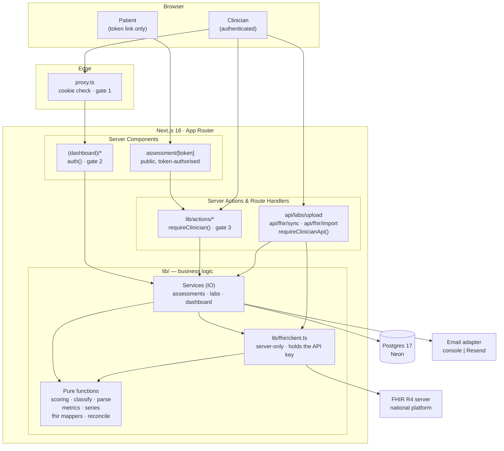
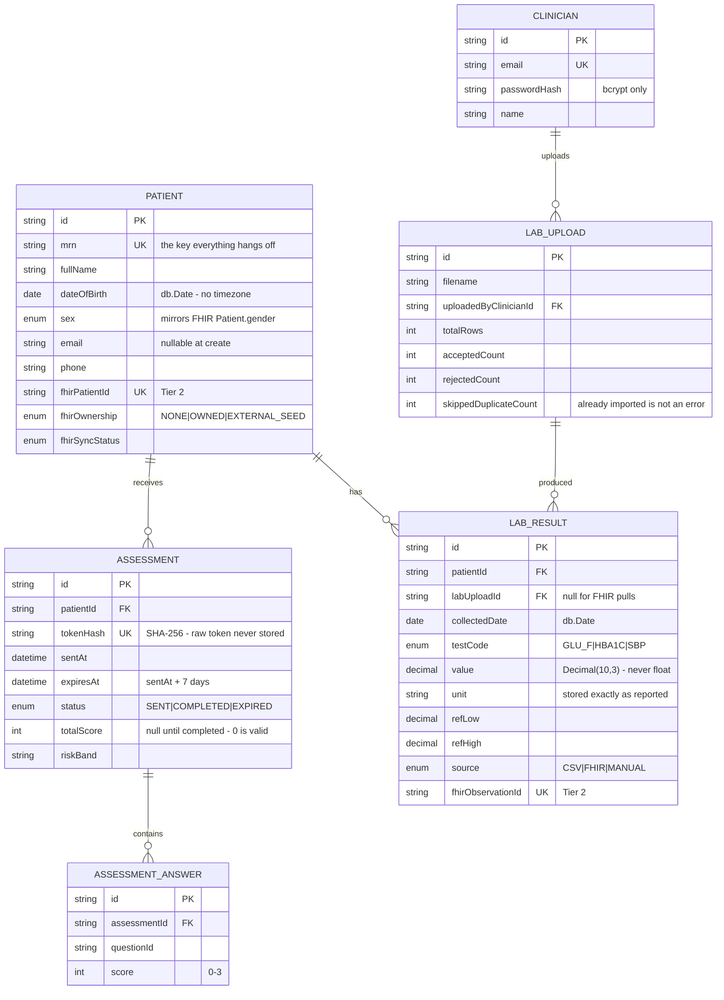
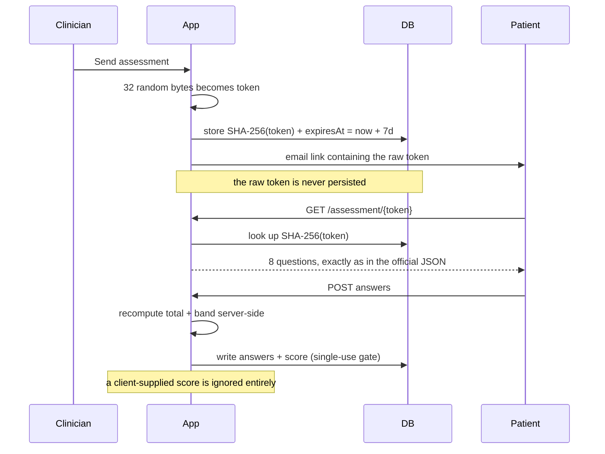
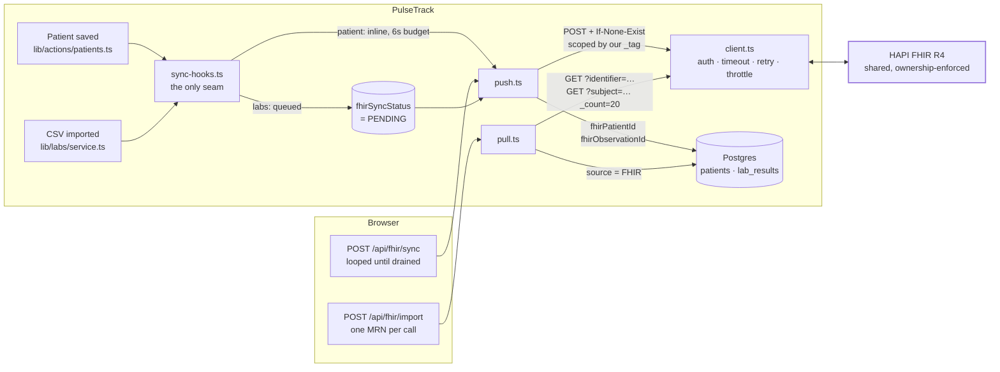

# PulseTrack

Remote patient monitoring for a diabetes clinic — a clinician logs in, manages a
patient register, emails patients a tokenized DSMA-8 questionnaire link, imports
lab results from messy CSV files, and reads the results as per-patient trends and
clinic-wide figures.

Built as a timed engineering challenge for **Capadev**.

> **Status:** Tier 1 (core platform) and Tier 2 (FHIR integration) are complete.
> Tier 3 (AI) is out of scope for this submission — see
> [What is and isn't built](#what-is-and-isnt-built).

---

## Contents

- [Quick start](#quick-start) — running locally in under 10 minutes
- [Architecture](#architecture)
- [Data model (ERD)](#data-model-erd)
- [How the three core flows work](#how-the-three-core-flows-work)
- [FHIR integration (Tier 2)](#fhir-integration-tier-2)
- [AI trajectory summary (Tier 3)](#ai-trajectory-summary-tier-3)
- [Security](#security)
- [Testing](#testing)
- [Deployment and CI/CD](#deployment-and-cicd)
- [Decisions and tradeoffs](#decisions-and-tradeoffs)
- [What is and isn't built](#what-is-and-isnt-built)

---

## Quick start

**Prerequisites:** Node.js 20+, and a Postgres database. The instructions below
use [Neon](https://neon.tech)'s free tier, which needs no credit card and is what
this project was developed against.

### 1. Install

```bash
git clone https://github.com/JoeYoussef44/PulseTrack.git
cd PulseTrack
npm install
```

`npm install` runs `prisma generate` automatically via `postinstall`, which
writes the typed client into `lib/generated/prisma`.

### 2. Create a database

Sign up at [neon.tech](https://neon.tech), create a project, and copy **both**
connection strings from the dashboard:

- the **pooled** string (host contains `-pooler`) → `DATABASE_URL`
- the **direct** string → `DIRECT_URL`

Two URLs are needed because serverless functions must go through the connection
pooler, while `prisma migrate` requires a direct session. See
[D-1](#d-1-two-database-urls).

### 3. Configure

```bash
cp .env.example .env
```

Fill in `.env`:

| Variable | Required | What it is |
|---|---|---|
| `DATABASE_URL` | ✅ | Neon **pooled** connection string |
| `DIRECT_URL` | ✅ | Neon **direct** connection string |
| `AUTH_SECRET` | ✅ | 32 random bytes — generate with `npx auth secret` |
| `SEED_CLINICIAN_EMAIL` | ✅ | The login the seed creates, e.g. `clinician@pulsetrack.local` |
| `SEED_CLINICIAN_PASSWORD` | ✅ | That login's password — choose anything |
| `APP_BASE_URL` | ✅ | `http://localhost:3000` locally; the deployed origin in production |
| `EMAIL_PROVIDER` | — | Leave empty to use the console adapter (see below) |
| `EMAIL_API_KEY`, `EMAIL_FROM` | — | Only if `EMAIL_PROVIDER=resend` |
| `FHIR_BASE_URL` | — | The national platform, e.g. `https://fhir-challenge.vihagent.net/fhir` |
| `FHIR_CANDIDATE_ID` | — | Our organisation tag on that server. Not a secret |
| `FHIR_API_KEY` | — | **Secret.** Never `NEXT_PUBLIC_`, never logged |
| `AI_PROVIDER` | — | `gemini` (default) or `groq`. Tier 3 |
| `AI_API_KEY` | — | **Secret.** A free key — no card. Tier 3 |
| `AI_BASE_URL`, `AI_MODEL` | — | Optional overrides; defaults are set per provider |

Leave the three `FHIR_` variables empty and everything in Tier 1 still works:
the integration page says which are missing and the rest of the app is
unaffected. Fill them in and the National platform page becomes live.

Leave `AI_API_KEY` empty and the same is true of Tier 3: the trajectory panel
on a patient page says the feature is not configured on this deployment, and
nothing else changes. A key from
[Google AI Studio](https://aistudio.google.com/apikey) turns it on.

### 4. Migrate and seed

```bash
npm run db:migrate    # creates the schema
npm run db:seed       # idempotent — safe to re-run
```

The seed creates one clinician, three patients (`MRN-1001` Jane Doe,
`MRN-1002` Samir Aoun, `MRN-1003` Rana Bitar), and an assessment history with
real trajectories so the dashboard has something to draw on first run. The three
MRNs are deliberately the ones referenced by the supplied
`lab-results-sample-clean.csv`, so that file imports 10/10 immediately — see
[D-6](#d-6-seeding-the-sample-csvs-mrns).

### 5. Run

```bash
npm run dev
```

Open <http://localhost:3000> and sign in with `SEED_CLINICIAN_EMAIL` /
`SEED_CLINICIAN_PASSWORD`.

### 6. See it working end to end

1. **Patients** → the three seeded patients, with search.
2. Open **Jane Doe** → four trend charts and her assessment history.
3. **Labs → Upload** → *Download template*, then upload
   `.docs/lab-results-sample-clean.csv` from this repo. It reports 10 accepted on
   a clean database, and 10 *already imported* if you upload it twice.
4. On a patient page, **Send assessment** → with no email provider configured the
   invitation is logged to your terminal and the UI shows a copy-able link. Open
   it in a private window to fill in the questionnaire as the patient would.

### Email in development

With `EMAIL_PROVIDER` unset, PulseTrack uses a **console adapter**: the email
body is written to the server log and the clinician is shown the assessment link
directly in the UI. This is deliberate rather than a stub — Resend's free tier
only delivers to the account owner's own address, so a live key would make the
demo *less* reproducible for an evaluator, not more.

---

## Architecture



### Layering rule

**Business logic lives in `lib/`, never in components. Pages fetch and render.**
Anything an evaluator is likely to probe — scoring, CSV validation, risk
classification, pagination, aggregate maths — is a **pure function** with no IO,
which is why the test suite can cover it exhaustively without a database.

```
lib/
├── assessments/  definition (loads the official DSMA-8 JSON) · scoring (pure)
│                 token · service
├── labs/         test-catalog · parse (pure) · classify (pure) · series (pure)
│                 service (IO)
├── dashboard/    metrics (pure) · service (IO)
├── email/        provider abstraction + console/resend adapters
├── validation/   Zod schemas
├── actions/      server actions — every one calls requireClinician()
├── fhir/         pagination helper (Tier 2 groundwork)
└── db.ts         Prisma singleton, server-only
```

### Authorization is three layers deep

Each layer is independently sufficient, because any one of them can be
misconfigured:

| Layer | Where | What it does | Why it isn't enough alone |
|---|---|---|---|
| 1 | `proxy.ts` (edge) | Rejects requests with no session cookie | A wrong `matcher` regex silently opens everything |
| 2 | `auth()` in each page | Server-renders nothing without a session | Doesn't cover POSTs |
| 3 | `requireClinician()` in every mutation | **The actual boundary** | — |

Hidden UI and the edge proxy are conveniences. Layer 3 is what holds when
somebody posts directly to an endpoint.

---

## Data model (ERD)



### The two constraints that carry the brief's guarantees

Both are **database** constraints, not application checks, so they hold under
concurrency rather than merely under well-behaved usage:

```prisma
@@unique([patientId, collectedDate, testCode])   // LabResult
@@unique([assessmentId, questionId])             // AssessmentAnswer
```

The first is the brief's duplicate-lab rule — same patient, same date, same test.
The second is why a double-submitted questionnaire writes eight answers, not
sixteen. Both were verified against the real database with concurrent requests,
not reasoned about.

### Three deliberate column choices

- **`@db.Date`, not `DateTime`,** for `dateOfBirth` and `collectedDate`. A birth
  date has no time zone; storing it as a timestamp produces off-by-one-day
  rendering west of UTC. All date handling goes through `parseIsoDate` /
  `toIsoDate` in `lib/validation/patient.ts`.
- **`Decimal(10,3)`, not `Float`,** for lab values. A binary float turns `5.8`
  into `5.800000000000001` on the way to a clinician's screen.
- **`totalScore` nullable, not defaulted to `0`.** A DSMA-8 score of 0 is a
  legitimate result — the best possible one. Defaulting would make "not yet
  answered" indistinguishable from "answered perfectly".

---

## How the three core flows work

### Assessment: token → email → public form → server-side score



The link is **single-use** and expires exactly 7 days after sending. Invalid,
expired and already-used links each get a distinct screen that leaks nothing
about whether the token ever existed.

### CSV import: three outcomes, not two

Every row lands in exactly one of three buckets:

| Outcome | Meaning |
|---|---|
| **Accepted** | Imported |
| **Rejected** | A data-integrity failure — unknown MRN, unknown test code, unparseable date or value |
| **Already imported** | Identical row already on file |

Splitting "already imported" out of "rejected" is what makes the brief's
re-upload requirement read correctly — see [D-3](#d-3-three-row-outcomes-not-two).

Errors and warnings are also separated. A **data-integrity failure rejects the
row**; a **cosmetic mismatch imports it and flags it**. A lab spelling a test
name differently is not a reason to lose a measurement.

### Dashboards

Per patient: four single-series trend charts — fasting glucose, HbA1c, systolic
BP, and DSMA-8 score over time. Clinic-wide: total patients, completion rate,
patients per risk band, and recent uploads with a date-range filter.

---

## FHIR integration (Tier 2)

The clinic reports to a shared HAPI **FHIR R4** server standing in for a national
health data platform. Data moves both ways: patients and locally-entered lab
results are **pushed** to it, and twelve months of seeded history for five
patients is **pulled** from it into the same tables as everything else.

### Data flow



**The local write always commits first.** A platform outage never rolls back a
clinical record and never blocks data entry. Sync state lives on the row
(`fhirSyncStatus`, `fhirLastError`), so a failure is a visible state rather than
a lost write.

### Ownership, and the trap in the API guide's own example

Reads on this server are open to every organisation; writes are not. Everything
we create is tagged with our candidate id, and only we can modify it.

The guide suggests making a create idempotent like this:

```
POST /Patient
If-None-Exist: identifier=https://challenge.capadev.dev/mrn|MRN-1001
```

That is unsafe on a shared server, and measurably so. `MRN-1001` is the MRN
printed in the supplied CSV template, so probing before writing any code:

```
GET /Patient?identifier=https://challenge.capadev.dev/mrn|MRN-1001
→ total = 5
  id=189 tag=cand-jihane-l    id=265 tag=cand-maryamhmayed-l
  id=278 tag=cand-marwa-l     id=340 tag=cand-adham-l
  id=360 tag=cand-khalils-l
```

Five other organisations already hold that MRN. The guide's header matches all
five and the server answers `412`. Had it matched exactly **one**, we would have
stored a stranger's resource id and every later `PUT` would have earned a
permanent `403` — a silent failure that looks like a bug in our code.

Every conditional create is therefore scoped by our ownership tag, and
`conditionalCreate()` appends that scope itself so no caller can forget it:

```
If-None-Exist: identifier=…|MRN-1001&_tag=https://challenge.capadev.dev/tags|cand-joe-l
```

Whether HAPI honours `_tag` inside that header was the open question, and
because the unscoped search matches five resources, a `201` answers it rather
than merely suggesting it:

```
POST /Patient  (tag-scoped)   → 201 Created   Location: …/Patient/816/_history/1
POST /Patient  (identical)    → 200 OK        Location: …/Patient/816/_history/1
```

**Belt and braces:** after any create-or-match, the response's own `meta.tag` is
checked before the record is treated as writable. A resource we can *see* is not
necessarily one we may *change*, and that distinction is not one to infer from a
request having succeeded.

### Idempotency

| Scenario | Guarantee | Mechanism |
|---|---|---|
| Push a patient twice | No duplicate remote `Patient` | `POST` + tag-scoped `If-None-Exist` on the MRN identifier; the second call returns `200` and the same id |
| Push a lab result twice | No duplicate remote `Observation` | `If-None-Exist` on our own identifier system carrying the local row's **cuid** — unique by construction, so unlike an MRN it can never match another organisation's resource |
| Retry after an ambiguous network failure | Still no duplicate | Exactly why every write is a conditional create rather than a plain `POST`: the retry's search finds whatever the lost response created |
| Import the seed data twice | No duplicate local rows, and no writes at all | Upsert patients by unique `mrn`; match observations by unique `fhirObservationId`, then by `(patientId, collectedDate, testCode)` |
| A remote failure mid-import | No local data loss | The local commit is a separate step from the sync, which only records status |

Measured, rather than asserted:

```
BEFORE re-push:  Patients=4  Observations=10
batch: {"patientsPushed":4,"resultsPushed":0,"failed":0,"more":false,"remaining":0}
AFTER  re-push:  Patients=4  Observations=10

re-import: imported=0  updated=0  unchanged=36  merged=0  ×5 patients
```

### Pagination — two things the guide gets wrong about its own server

**The `next` link cannot be followed as given.** It points at `http://hapi:8080`,
the server's own container hostname, which is unreachable from outside:

```
next → http://hapi:8080/fhir?_getpages=c9b366f6-…&_getpagesoffset=20&_count=20
```

Following it verbatim, as the guide instructs, fails in the worst possible way —
silently, truncating every import to its first page while looking successful.
`lib/fhir/pagination.ts` keeps the link's path and query (which carry the
server's opaque `_getpages` cursor and must not be reconstructed by hand) and
re-bases them onto the configured public host.

**`_count=20`, not the guide's 50.** Each seeded patient has exactly 36
observations, so at `_count=50` everything returns in a single page, no `next`
link is ever emitted, and the pagination code never executes. The import would
be an integration that *looks* paginated and has never paginated once. At 20
every patient pages twice — 20 + 16 — which the per-patient report shows.

Loop control depends on the presence of a `next` link and nothing else:
`bundle.total` is present on an unpaged search and **absent** on a paged one.
The walk also guards against a cursor that points back at a page already read,
caps the number of pages, and **reports truncation** rather than hiding it — a
silently truncated import is worse than a failed one, because it looks like it
worked.

### Failures: transient versus terminal

The distinction that governs everything in `lib/fhir/errors.ts`. A `403` is not a
failure to retry — it is a permanent fact about ownership, and retrying it spends
a documented 120 requests/minute re-learning it.

| Status | Retried | Behaviour |
|---|---|---|
| `400` / `422` | No | Our resource is malformed. Show the server's `diagnostics`; fix, don't retry |
| `401` | No | Surfaced as "check `FHIR_API_KEY`" |
| `403` | No | Recorded as `FORBIDDEN` — a **state**, excluded from the queue so it can actually drain |
| `404` | No | The linked resource is gone |
| `405` | No | We issued a disabled operation (DELETE, conditional update, update-as-create). A programming error |
| `412` | No | `If-None-Exist` matched more than one resource — surfaced for inspection |
| `429` | **Yes** | Honours `Retry-After`, else exponential backoff **with jitter** |
| `5xx`, timeout, reset | **Yes** | Up to 3 attempts with backoff |

Verified by pointing the client at a bad key and an unreachable host:

```
wrong API key → 401 : "…rejected our credentials. Check FHIR_API_KEY."   1218ms  (one attempt)
unreachable host    : "Could not reach the national platform."           4302ms  (three, with backoff)
recovery            : {"ok":true,"fhirId":"818","created":false}  →  SYNCED
```

Rate limiting is also handled **proactively**. Reacting to a `429` is necessary
but not sufficient: a seed import is three requests per patient and a push is
one per record, so importing and then syncing a CSV can put a few hundred
requests through in under a minute — an unthrottled client earns the limit
rather than avoiding it. `throttle.ts` holds a
sliding window at 100/min against the documented 120, with a concurrency cap of
4, leaving headroom for the retries.

### Why the work is batched, and driven from the browser

Vercel's Hobby plan caps a function at 60 seconds, and both directions of this
integration are naturally larger than that:

- **The push** is one request per record. A CSV can hold thousands of rows, so
  pushing inside the upload request would exceed the function budget long before
  the rate limit — and would do so while the clinician waits for the validation
  report. `/api/fhir/sync` pushes a bounded batch and reports whether more
  remain; the browser loops until it is told to stop.
- **The pull** takes one MRN per call. Five patients at 36 observations each is
  the single slowest thing in the app; per-patient, one failure does not take the
  other four with it, and the report can say what happened to *that* patient.

Both loops also give the UI something real to show — a count going down, a row
per patient — instead of a spinner of unknown length.

**A patient is the exception and syncs inline**, bounded at 6 seconds, because
"create a patient and it appears on the platform" is what the brief asks for and
a queue someone must drain by hand is not that. If the budget lapses the record
is already marked pending, so nothing is lost.

### What is never pushed

`source = FHIR` rows are excluded from the push queue entirely. Sending the
platform's own data back would duplicate its records and misrepresent where they
came from. The integration page shows this rule as a figure: **Results sent
10 / 10** while **180** are imported.

Seeded patients are marked `EXTERNAL_SEED` and never written to at all.


---

## AI trajectory summary (Tier 3)

One feature: a **Summarise** button on a patient page that writes three to five
sentences about what that patient's recorded data shows, next to the figures it
was written from.

The brief says this tier evaluates *"judgment, not ambition"* and asks four
questions. This section answers them in order.

### Is it grounded in the real data?

Yes, and in a stronger sense than "the model was given the records".

The obvious build is to hand the model the patient's rows and ask what it sees.
That asks a language model to do arithmetic and to decide what is clinically
notable, and it will do both fluently whether or not it does them correctly. A
fabricated HbA1c delta reads exactly like a real one.

So the split runs the other way. **Every number is computed in TypeScript, and
the model only narrates them.**

```
lib/ai/facts.ts      pure   patient rows -> a fact object
lib/ai/prompt.ts     pure   system prompt + the fact object, and nothing else
lib/ai/verify.ts     pure   every number in the prose, checked against the facts
lib/ai/provider.ts   server-only, holds the key, one POST
lib/ai/summary.ts    load -> facts -> narrate -> verify
```

`facts.ts` computes, per test: first and latest value, the change, the
direction, the span in days, the reference range, where the latest value sits
against it, and how many readings fall outside it. Per questionnaire: the two
most recent completed scores, their bands, the change, and whether the band
moved. Plus age, sex, and how stale the data is.

Everything the model can say is therefore already true before it is asked to
say anything.

### How is hallucination risk handled?

Three layers, and only the first is a prompt.

**1. The prompt forbids it.** Specific and checkable rather than "be careful":
*never write a number that does not appear in the JSON; never diagnose; never
suggest or adjust treatment; never mention medications or dosages; never
speculate about a cause.*

**2. The output is verified, mechanically.** `verify.ts` extracts every number
from the returned prose and asserts each one exists in the fact payload. A
summary containing a figure that is not in its own source is **discarded and
never shown** — the panel falls back to displaying the facts alone, and says
why. This is the part that matters: reducing the model to a narrator is what
makes the check possible, and the check is what turns the design from a promise
into something with a visible failure mode.

Three details the number scan had to get right, each of which produced a false
verdict in testing before it was fixed:

- `HbA1c` and `DSMA-8` contain digits, and reported two inventions on a
  correct summary until instrument names were stripped first.
- Dates are stripped too. Admitting every year, month and day into the allowed
  set instead would let a fabricated score of `14` pass because some reading
  happened on the 14th.
- A number ending a sentence — `...rose to 7.1.` — was skipped entirely by the
  first pattern, so a fabrication in the most common position would never have
  been checked. There is a regression test for it.

**3. The facts are rendered beside the prose.** Always, in the same panel. A
clinician reads the summary *against* its source rather than instead of it.

### Is the prompt design thoughtful?

The model is cast as a narrator, not an analyst, and every instruction follows
from that — there is no "work out the trend", because the trend is already in
the input.

One decision is worth calling out. **The DSMA-8 score direction is stated
twice**: in the system prompt and again inside the payload as
`scoreDirectionNote`. Every DSMA-8 item is negatively worded — *"I missed or
skipped a dose of my diabetes medication"* — so a **higher score is a patient
doing worse**. That is the opposite of the prior a model brings to a score out
of 24, it is the single most likely error, and getting it backwards inverts the
entire summary while reading perfectly well. It is asserted in a test as well.

Temperature is 0.2 — low, but not zero, because this is prose and zero produces
the same stilted sentence every time. The grounding guarantee comes from the
verifier, not from pinning the sampler, which is what makes that affordable.

### Is it actually useful?

It is one button on a page the clinician is already reading, and it answers the
question the charts do not: *what changed, and by how much.* The three charts
show shape; the tables show rows; neither says "HbA1c rose 0.3 over 63 days,
both readings above range, while the DSMA-8 score moved from Moderate to High."

It refuses to produce prose in two cases rather than padding: **fewer than two
data points**, and **an ungrounded response**. Both are designed states.

### What it deliberately does not do

- **No chat, no history, no streaming, no RAG.** One button, one call.
- **Nothing is persisted.** A machine-written narrative is not a clinical
  record, and storing it would make it one — it would outlive the data it
  described with no way for the next reader to tell a stale summary from a
  current one. It is recomputed on request, or not shown.
- **No clinical thresholds are invented.** `facts.ts` reports direction,
  magnitude and range status. "Concerning" and "improving" are words for a
  clinician; a threshold invented in our code would be an unsourced clinical
  rule wearing the costume of a computation.

### What is sent to the provider

Age, sex, and the computed fact object. That is the whole payload.

**Never sent:** name, MRN, email, phone, the date of birth itself, any token, or
anything about any other patient. Age is derived from the date of birth and the
date of birth is then discarded — it is not a parameter of any function in
`facts.ts`, so it cannot leak by someone later passing the wrong object. A test
asserts the serialised payload against each forbidden field, because a type
cannot fail at runtime.

The key is server-side only, never `NEXT_PUBLIC_`, never logged. The provider's
response body is never logged either: a provider that echoes the request back
would put the fact payload into a log line.

### Limitations, stated plainly

- **The verifier catches fabricated numbers, not fabricated meaning.** Every
  clinical statement in this summary is numeric, which is why the check is worth
  as much as it is — but a fluent, entirely non-numeric wrong claim would pass.
  Nothing mechanical would catch that, which is why the facts are on screen.
- **The allowed-number set is generous with small integers.** It contains every
  number in the payload, so a fabricated `2` may coincide with a real count. The
  check is strongest exactly where it matters most — decimal clinical values.
- **It depends on a free tier.** A rate-limited provider is a designed error
  state, not an outage, but the button will sometimes say try again shortly.
- **It is not a second opinion.** It restates recorded data in sentences. It has
  no access to the notes, the history, or the patient.

### Provider

An OpenAI-compatible `/chat/completions` endpoint rather than an SDK. Gemini,
Groq, OpenRouter, Cerebras and Mistral all speak it, so switching provider is
two environment variables instead of a rewrite — which matters because the
feature depends on a free tier that can rate-limit at the wrong moment. It also
keeps a dependency out of `package.json` for one `fetch` of a documented JSON
shape.

Default is Google Gemini. Set `AI_MODEL` to whatever your console lists — model
ids change more often than endpoints do.

---

## Security

| Control | Implementation |
|---|---|
| Password storage | bcrypt hashes only; never the password |
| Login timing | An unknown email hashes a dummy value, so it costs the same as a wrong password and can't be distinguished by timing |
| Session | Auth.js v5, JWT strategy (mandatory with the Credentials provider) |
| Assessment tokens | 32 random bytes; only the SHA-256 hash is persisted, so a database dump hands out no working links |
| Score integrity | Always recomputed server-side from stored answers; a browser-supplied score is ignored |
| Authorization | Three layers, above; `requireClinician()` in every mutation |
| Secrets | `.env` is gitignored; no secret is ever exposed through `NEXT_PUBLIC_`; git history was scanned before publishing |
| Logging | Ids and counts only — never names, emails, MRNs, answers or tokens |
| FHIR API key | Confined to `lib/fhir/client.ts` and `config.ts`, both `server-only`, so a client-component import is a build error rather than a leaked credential. Verified absent from the rendered page |
| FHIR data minimisation | Email and phone are deliberately **not** sent as `telecom`. The server is shared and reads are open, so every field we push is readable by every other organisation on it |
| FHIR import surface | `/api/fhir/import` accepts only the documented seed MRNs. Accepting any MRN would turn an authenticated session into a lookup tool for every record on a shared server |
| External errors | `OperationOutcome.diagnostics` is truncated and sanitised before it is stored or shown; raw response bodies never reach the UI or the logs |
| AI key | Confined to `lib/ai/config.ts` and `provider.ts`, both `server-only`. Whether a key exists is decided on the server too, so neither the key nor its presence reaches the browser |
| AI data minimisation | Age and sex plus computed figures. Name, MRN, email, phone, the date of birth itself and every token are never sent — and are not parameters of any function in `lib/ai/facts.ts`, so they cannot leak by passing the wrong object. Asserted in a test against the serialised payload |
| AI output | Every number in a generated summary is checked against its source; an unsourced figure means the summary is discarded, not shown with a caveat. Nothing generated is persisted |
| Patient data | Entirely fabricated |

> **This is good practice, not compliance.** No claim of HIPAA or GDPR
> conformance is made or implied. A real deployment would additionally need
> audit logging, encryption at rest with managed keys, a BAA with each
> processor, formal access reviews, and a breach-notification process.

---

## Testing

```bash
npm test        # vitest
npm run lint    # eslint
```

299 tests, concentrated on the pure functions — scoring and every risk-band
boundary, CSV parsing against BOM/CRLF/quoted/ragged input, classification,
dashboard aggregates, date round-tripping, the whole FHIR mapping and
reconciliation layer, and the Tier 3 grounding.

The AI tests follow the same principle as the FHIR ones: the interesting
failures are all in code that never touches the network. They cover the
arithmetic, the DSMA-8 score-direction inversion — a *rising* score is a patient
doing worse, which is the opposite of the prior a model brings to a score out of
24 — that the prompt payload carries no identifying field, and both directions
of the output verifier, including the three shapes that made it return a false
verdict before they were fixed.

The FHIR tests carry more weight than the rest, for a specific reason: **the
server's writes are permanent** — `DELETE` is disabled — so the mappers, the
retry policy and the import's collision handling are the only parts of that
integration that can be exercised freely. They cover the mapping in both
directions, that `400/401/403/404/405/412/422` are never retried while
`429/5xx/timeout` are, `Retry-After` handling, the throttle's ceiling and
concurrency cap, and every branch of the import's two-constraint reconciliation
— including that a locally-held value is never overwritten by a remote one.

Tests are only half of it. Several defects in this project produced a *plausible
wrong answer* rather than an error, and were found only by running the thing and
reading the output:

| Found by | Defect |
|---|---|
| A test written before the UI | The CSV header was inferred from the first data row's keys — so a short first row rejected the entire file, exactly the messy input the importer exists to survive |
| `curl` on the endpoint | `POST /api/labs/upload` returned `307` to `/login` instead of `401`. `fetch` follows the redirect, receives login HTML with a `200`, and parses it as JSON — so an expired session rendered an **empty report** rather than an error |
| Running a colour-vision validator | Two adjacent risk-band colours measured ΔE **0.4** under deuteranopia — literally the same colour |
| Re-reading the brief against the work | The clinic view's required "recent uploads with at least one filter" was missing entirely |
| Probing the live FHIR server before writing a line of client code | The API guide's own `If-None-Exist` example matches five other organisations' copies of `MRN-1001`. Following the guide would have stored a stranger's resource id and earned a permanent `403` on every later write |
| Timing the first sync batch | 14 records took **12.8s** pushed sequentially — a fifth of a Vercel function's budget — while the throttle's concurrency cap sat unused because nothing ever ran concurrently. Now 3.2s |
| Timing the second import | A re-import was idempotent but took **10s per patient against 2.4s** for the first, writing 180 unchanged rows back one at a time. Comparing before writing brought it to 2.1s |
| Driving a headless browser at 375px | Three layout defects nobody had seen, because Recharts only draws client-side and no browser pass had ever been run: `/labs/upload` scrolled sideways (a `-mx-5` breakout inside a `Card` with no padding to cancel it), a risk-band label was truncated to `not survey…` **at every width**, and the nav clipped "National platform" on every authenticated page |
| Writing the test for the AI verifier before trusting it | The number scanner skipped any figure ending a sentence — `...rose to 7.1.` — because its lookahead excluded a trailing full stop. A fabricated number in the most common position in the output would never have been checked, and the verifier would have reported every summary as grounded |

---

## Deployment and CI/CD

Two environments, two URLs, both deployed from git. Nothing is deployed by
hand, which is the point: the URL an evaluator opens is built from a commit
that is in the repository, not from whatever happened to be on a laptop.

| Branch | Vercel environment | URL |
|---|---|---|
| `main` | Production | `https://<project>.vercel.app` |
| `dev` | Preview | `https://<project>-git-dev-<scope>.vercel.app` |

Work merges into `dev`, is checked on the preview URL, and `dev` merges into
`main` when it is right. Every other branch also gets its own preview
deployment, which is what makes a pull request reviewable as a running site
rather than as a diff.

### The two halves

**CI — GitHub Actions** (`.github/workflows/ci.yml`) runs lint, typecheck and
the test suite on every pull request into `dev` or `main`, and on the branches
themselves. It touches no database: the suite is entirely pure functions, and
the workflow's placeholder connection strings exist only because `lib/db.ts`
throws at import when `DATABASE_URL` is unset.

**CD — Vercel's git integration** builds and deploys every push. The build
command lives in `vercel.json` rather than in the dashboard, so it is
version-controlled and reviewable:

```json
"buildCommand": "prisma migrate deploy && next build"
```

`prisma migrate deploy` applies pending migrations and never generates new
ones — `migrate dev` is a local-only command and would be wrong here.

### First-time setup

```bash
npm i -g vercel        # or use npx
vercel login
vercel link            # choose the existing project, or create it
```

Then push the environment variables. Ten variables across two environments is
sixty-odd fields to retype, and a mistyped connection string fails at runtime
rather than at paste time:

```bash
bash scripts/vercel-env.sh
```

It reads `.env`, never prints a value, and can be re-run to update. Two
variables are deliberately excluded:

- **`APP_BASE_URL`** is set for **production only**, once the URL exists. A
  preview carrying a production `APP_BASE_URL` would email assessment links
  that leave the preview entirely — the clinician tests on `dev` and the
  patient lands on the live site. Left unset, `lib/actions/assessments.ts`
  falls back to `VERCEL_URL`, so each preview links to itself.
- **`SEED_CLINICIAN_*`** are never needed by a build. The seed runs from a
  developer machine against `DATABASE_URL`. Every secret Vercel does not hold
  is one that cannot leak from it.

Deploy, then set the production base URL now that you know it:

```bash
vercel --prod
vercel env add APP_BASE_URL production     # https://<project>.vercel.app
vercel --prod                              # env vars are read at build time
```

That last redeploy is not optional. Environment variables are baked in at
build time, so an existing deployment never sees a variable added after it.

### One consequence of sharing a database

`dev` and `main` point at the same Neon database. That is a deliberate
trade — the preview URL shows the same demo data as production, and there is
nothing extra to seed — but it has a consequence that has to be respected:

> **Migrations must be additive while the two share a database.** `dev`
> deploys before `main`, so `dev` applies a migration while production is
> still running the previous code. Adding a nullable column or a table is
> safe. Dropping or renaming one breaks production the moment `dev` deploys,
> and the failure appears on the URL nobody was testing.

The safe pattern is expand-then-contract: add the new column, ship code that
writes both, and only remove the old one in a later release once production no
longer references it. Splitting the environments onto separate Neon branches
removes the constraint entirely and is what a longer-lived project should do.

### Notes for this deployment

- **Region.** Neon is in AWS `us-east-1`; Vercel's default `iad1` is the same
  place. Check it in the project settings if latency looks wrong — a function
  in Europe talking to a database in Virginia adds a round trip to every query.
- **Neon cold starts.** The free tier suspends compute after a few minutes
  idle and the next connection wakes it, measured at ~3s. `lib/db.ts` sets a
  15s connection timeout for exactly this reason. An evaluator opening the
  link days later hits it on their very first request.
- **Function duration.** The CSV import and the FHIR routes declare
  `maxDuration = 60`, the Hobby ceiling. Both are batched so that no single
  invocation approaches it.

## Decisions and tradeoffs

### D-1: Two database URLs

Serverless functions exhaust Postgres connections quickly, so runtime traffic
goes through Neon's **pooled** endpoint. But `prisma migrate` needs a direct
session that a pooler can't provide. Hence `DATABASE_URL` (pooled, runtime) and
`DIRECT_URL` (direct, migrations). Getting this wrong produces intermittent
500s under load — the worst kind of bug to discover during a demo.

### D-2: A mismatched unit is stored as reported, never relabelled

If a CSV says `5.8 mmol/L` where the catalog expects `mg/dL`, PulseTrack stores
`mmol/L` exactly as given and flags the row. It does **not** rewrite the label.

Silently relabelling would turn a normal glucose reading into a fatal-looking
one while appearing to be a helpful tidy-up. A pure case or spacing difference
(`MG/DL`) normalises silently, because that carries no clinical meaning.

**Tradeoff:** the chart may show mixed units for a patient whose lab changed
format. Visible and correctable beats invisible and wrong.

### D-3: Three row outcomes, not two

Under accepted/rejected alone, correcting two bad rows and re-uploading the file
reports the eight already-good rows as **errors**. That is alarming and false.
"Already imported" is a third, non-error outcome.

### D-4: A changed value on re-upload is skipped and reported, never overwritten

If a row matches an existing `(patient, date, test)` but carries a *different*
value, PulseTrack refuses it and says so. Silently overwriting a stored clinical
measurement is not something an import should ever do unattended.

**Tradeoff:** genuinely corrected results need manual intervention. Correct
default.

### D-5: A malformed reference range warns; it never rejects the row

An inverted or unparseable `ref_low`/`ref_high` falls back to the catalog range
and warns. A reference range is chart furniture; the measurement is the data.
Losing a real glucose reading over a broken annotation is the wrong trade.

### D-6: Seeding the sample CSV's MRNs

The supplied `lab-results-sample-clean.csv` references `MRN-1001/1002/1003`,
which exist nowhere by default. Without seeding them, an evaluator's very first
upload rejects 10 of 10 rows and the importer looks broken when it is in fact
working perfectly. The seed creates exactly those three.

### D-7: One measure per chart, never a dual axis

Two y-scales can be aligned arbitrarily, so plotting glucose against HbA1c on
shared axes *asserts a correlation the data does not contain*. Three measures,
three charts.

### D-8: Risk bands render as one labelled bar per band — never stacked, never a pie

The four bands are a continuous green→yellow→orange→red ramp, so **neighbouring
colours are inherently close**: moderate↔high measured ΔE 8.0 for normal vision
and **0.4 under deuteranopia**.

Re-stepping the palette only moved the collision to orange↔red — which is the
tell. On a continuous hue ramp, adjacent steps are *always* close, and stacking
them makes hue the only channel available to separate them. So the **form**
changed instead of the colours: one labelled bar per band, no two fills
touching, every bar carrying its own name and number. Each band clears 3:1
contrast against the surface on its own, and the questionnaire's traffic-light
semantics survive.

### D-9: The dashboard's date filter scopes the uploads card only

Completion rate is all-time by decision, and the risk distribution is a snapshot
of the register as it stands. Applying a global date filter to those wouldn't
narrow them to a smaller truth — it would turn them into a different and
misleading number. The filter therefore scopes the card the brief asks it to.

### D-10: Completion rate is completed divided by all sent, all time

Expired counts as not completed. Shows `—`, not `0%`, when nothing has been
sent — an empty clinic has no completion rate, and `0%` reads as failure.

### D-11: Each patient counted once in the risk distribution, by their latest completed assessment

Counting assessments instead would let one frequently-assessed patient dominate
the clinic's risk profile.

### D-12: Hard delete, with confirmation

Patients delete for real, cascading to assessments, answers and labs. A soft
delete would be more defensible clinically but adds an `active` filter to every
query and every aggregate — a large surface for a subtle wrong-number bug within
this timebox. Documented rather than hidden.

### D-13: API routes authorize themselves

The edge proxy used to match `/api/*` and **redirect** unauthenticated requests
to `/login`. That's the `307`-instead-of-`401` defect in the table above. API
paths are now exempt from the *redirect* — never from *authorization*. Every
route handler calls `requireClinicianApi()` itself.

### D-14: Console email adapter as the default

Covered under [Email in development](#email-in-development). The abstraction in
`lib/email/` means switching to Resend is one environment variable.

### D-15: Recharts time axis is numeric, not categorical

A string x-axis in Recharts is **categorical** — points plot in array order at
even spacing regardless of what the labels say. A back-dated result draws a line
that doubles back on itself, and a year's gap looks identical to a day's. The
charts use `type="number"` with `scale="time"` over millisecond timestamps, and
`lib/labs/series.ts` sorts chronologically. A single reading gets a padded
domain, because `dataMin === dataMax` is a zero-width axis where the marker
vanishes.

### D-16: Conditional creates are scoped by our ownership tag

The API guide's `If-None-Exist: identifier=…|MRN-1001` matches **any**
organisation's `MRN-1001`, and five of them already have one. Scoping by
`_tag` makes idempotency mean "ours", and the response's `meta.tag` is checked
before anything is treated as writable.

The cost: if the server ever stopped supporting `_tag` as a search parameter,
this would create a second copy of each patient rather than failing loudly. That
is why `meta.tag` is verified on every response rather than trusted once.

### D-17: Observations are keyed on the local row's cuid, not on a natural key

An MRN is shared vocabulary; a cuid is ours alone. Keying the Observation's
`If-None-Exist` on the local `LabResult` id makes the match exact even though
reads are open to everyone, and it is what makes a retry after an ambiguous
network failure safe.

### D-18: Pulled data is never pushed back, and a merge never overwrites

`source = FHIR` rows are excluded from the push queue: sending the platform's own
records back would duplicate them and misrepresent their provenance.

And where an import meets a measurement already held locally — same patient, date
and test, entered from a CSV — the link is attached and the **stored value is
left alone**. Silently editing a clinician's record because a remote resource
shares a date is how a clinical system stops being trustworthy. Where the two
disagree it is counted and shown. This is the same rule a re-uploaded CSV row
already follows (D-4).

The cost: the two systems can hold different values for one measurement, and we
show that rather than resolving it. Resolving it automatically would mean
choosing a winner without a clinician, which is not ours to choose.

### D-19: Sync work is batched and driven from the browser

One bounded batch per request, looped by the client, because a Vercel function
has 60 seconds and both a large CSV push and a five-patient import are naturally
larger than that. The alternative — a background job — needs infrastructure this
submission does not have, and would give the clinician nothing to watch.

A single patient is the exception and syncs inline within a 6-second budget,
because the brief asks for a patient to sync *when they are created*.

### D-20: The model narrates precomputed facts; it is never asked to analyse

Every number in an AI summary is computed in TypeScript first. The model
receives a finished fact object and writes prose about it.

The alternative — handing over the rows and asking what it sees — asks a
language model to do arithmetic and to judge clinical significance, and it does
both fluently whether or not it does them correctly. This way, every figure the
summary can contain is already true, a fabricated one becomes mechanically
detectable, and the same object can be rendered beside the prose so a clinician
checks one against the other. It is also less code, not more.

### D-21: An ungrounded summary is discarded, not flagged

`verify.ts` extracts every number from the returned prose and checks it against
the fact payload. A summary carrying a figure that is not in its source is not
shown with a warning attached — it is thrown away, and the facts are displayed
alone with an explanation.

Showing suspect clinical prose with a caveat next to it assumes the caveat is
read. In a clinical context the safer default is that the system declines to
show what it knows to be unsourced.

### D-22: The AI summary is never persisted

It is recomputed on request or not shown. A machine-written narrative stored
against a patient becomes part of the record: it outlives the data it described,
and the next reader has no way to tell a stale summary from a current one.

---

## What is and isn't built

### Tier 1 — complete

| Area | Status |
|---|---|
| Authentication | ✅ |
| Patient management (CRUD, search, validation) | ✅ |
| Email questionnaire flow | ✅ |
| CSV lab upload | ✅ |
| Dashboards and charts | ✅ |
| Documentation | ✅ (this file) |

### Tier 2 — FHIR integration: complete

| Requirement | Status |
|---|---|
| Push patients on create/update as `Patient` | ✅ |
| Push imported lab results as linked `Observation`s | ✅ |
| Pull the five seeded patients and their history | ✅ 180 observations |
| Authentication, failures, retries, no double-import | ✅ |
| Integration diagram in this README | ✅ [above](#fhir-integration-tier-2) |

Three read-only reconnaissance findings shaped the implementation, each of which
contradicts the API guide about its own server, and each of which would have
failed silently:

1. **Pagination `next` links point at `http://hapi:8080`**, unreachable from
   outside. Following them verbatim truncates every import to page one.
2. **`bundle.total` is absent on paged responses**, so loop control depends on
   the `next` link alone.
3. **Each seeded patient has 36 observations, not 180.** At the guide's
   `_count=50` nothing paginates, so the pagination path would never run.

A fourth was found by probing before the first write: **five other candidates
already hold `MRN-1001`**, so the guide's own `If-None-Exist` example matches
foreign resources. See [Ownership](#ownership-and-the-trap-in-the-api-guides-own-example).

### Tier 3 — AI feature: complete

One feature: the **trajectory summary** on a patient page. Full reasoning in
[AI trajectory summary (Tier 3)](#ai-trajectory-summary-tier-3).

The design in one line: every number is computed in TypeScript, the model only
narrates them, and a verifier discards any summary containing a figure that is
not in its own source.

Started only after Tiers 1 and 2 were complete, deployed and verified live,
which is the order the brief asks for.

### Known limitations

- **Assessment expiry is derived on read**, not swept by a job. A `SENT`
  assessment past `expiresAt` reads as expired everywhere it is displayed, but
  the stored row keeps `status = SENT` until it is next looked at. This is the
  right trade without a scheduler, and the `[status, expiresAt]` index exists to
  make a sweep cheap when one is added.
- **Resend's free tier only delivers to the account owner's address.** With a
  live key configured, sending to an arbitrary patient address will fail. The
  console adapter and the in-app copy-link exist precisely because of this.
- **No audit log.** Every mutation is authorized, but who changed what and when
  is not recorded. A real clinical system needs this.

---

## Stack

Next.js 16 (App Router) · React 19 · TypeScript · Tailwind 4 · Prisma 7 on
Neon Postgres 17 · Auth.js v5 (Credentials + JWT) · Zod 4 · Recharts 3 · Vitest.
Deployment target: Vercel.

## Commands

```bash
npm run dev          # dev server
npm run build        # production build
npm start            # serve the build
npm run lint         # eslint
npm run typecheck    # next typegen && tsc --noEmit
npm test             # vitest
npm run db:migrate   # prisma migrate dev
npm run db:deploy    # prisma migrate deploy (production)
npm run db:seed      # idempotent seed
npx prisma generate  # regenerate the client into lib/generated/prisma
```

Running a one-off script that imports from `lib/` needs the server-only
condition, because those modules import `server-only` by design:

```bash
NODE_OPTIONS="--conditions=react-server" npx tsx script.ts
```
